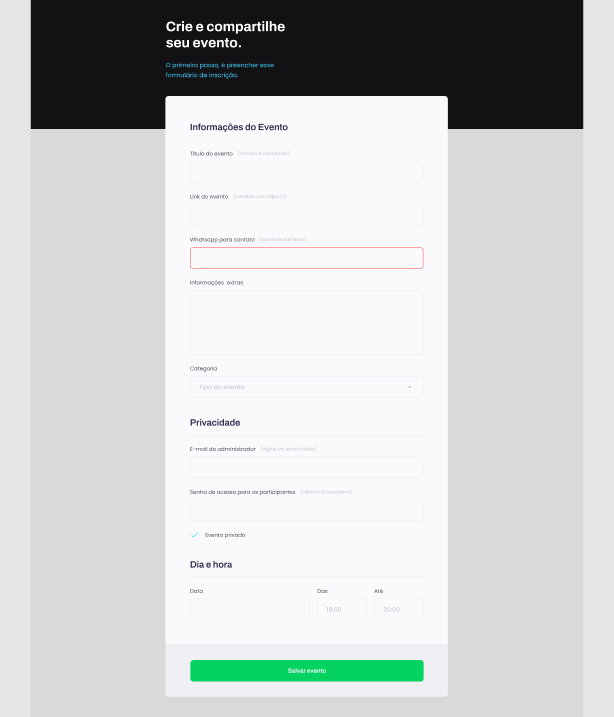

<h1 align="center"> Event Form</h1>

The project is an event form.  

  <a href="#-Preview">Preview</a>&nbsp;&nbsp;&nbsp;|&nbsp;&nbsp;&nbsp;
  <a href="#-tecnologias">technologies</a>&nbsp;&nbsp;&nbsp;|&nbsp;&nbsp;&nbsp;
  <a href="#-projeto">Project</a>&nbsp;&nbsp;&nbsp;&nbsp;&nbsp;&nbsp;

 

## 🔖 Preview

see the preview of the project:

## 🚀 technologies

This project was developed with the following technologies:

- HTML and CSS
- Git and Github

## 💻 Project

  

- [Visit the project online] ( )
 
 
---

Made with ♥ 
 
Daniel Nicolas Leoterio